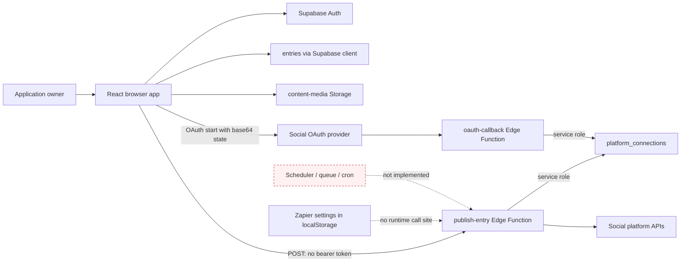

# Comprehensive Application Review

## Checkpoint 1 — scheduled-publishing integrity

- **Review date:** 16 July 2026
- **Branch reviewed:** `feature/social-docs-2026-refresh`
- **Review mode:** read-only application review; no product code, configuration, dependency, migration or production-data changes
- **Primary risk examined:** duplicate, missed or incorrect publication in the scheduled-publishing path
- **Finding limit:** 10
- **Checkpoint:** 25 minutes of focused inspection, followed by targeted verification and reporting

### Scope statement

This is the first bounded checkpoint of the requested whole-application audit. It is **not a whole-application verdict**. It covers the path from creating a dated entry through media selection, approval, manual publishing, platform connection lookup, platform API calls and publication-status handling. Authentication and credential boundaries were examined where they directly control this path.

Reporting accuracy, the full authentication lifecycle, every database table and policy, general performance, all-page UX, WCAG conformance, CI/CD, backup/restore and broad dependency/code-quality review remain outside this checkpoint. Those areas must not be inferred as safe from this report.

The repository already contained uncommitted changes. They were treated as owner work and were not modified.

### Deployment-target correction — 16 July 2026

The runtime configuration targets the shared **Intel Hub** Supabase project (`oepehanwmfelowfumkes`), not the inactive standalone Content Hub project used for the report's first hosted check. A corrected read-only check confirmed that the runtime project's `publish-entry` v1 and `oauth-callback` v1 are active with `verify_jwt=false`; deployed source confirms the same PUB-001 and PUB-007 behaviours. The shared database is also currently reported inactive and read-only SQL timed out. This correction supersedes the v13/v12 function-version references later in the original snapshot without changing the finding severities.

---

## A. Executive summary

### Assessment

**Publishing-path rating: Not production-ready.** An overall application rating is deferred until the remaining paths are reviewed.

The direct-publishing subsystem has one confirmed Critical trust-boundary defect and several High reliability defects. The hosted `publish-entry` Edge Function is active with JWT verification disabled. Its deployed and repository source accept publication content without a mandatory authenticated-user check, then use the Supabase service role and stored social credentials. A webhook secret is checked only when a deployment secret happens to be configured. The current browser caller neither sends an access token nor the optional publishing secret. Consequently, the deployed arrangement is either externally callable when no secret is configured, or the normal “Publish now” path is broken when one is configured.

Scheduling is not implemented as an executable workflow. The app records a calendar date, displays “Scheduled” and “Auto-publish” language, and stores Zapier settings in browser local storage, but there is no scheduler, queue, cron worker or call site that uses those settings. It cannot guarantee a post at a particular time, timezone or daylight-saving boundary.

Manual publishing is also vulnerable to duplicate and misleading outcomes. There is no idempotency key, server-side claim, durable attempt record or server-side approval check. A platform can accept a post while the client times out or fails to persist the result, leaving the entry eligible for another click. Partial results are collapsed into a single `Published` workflow state, including a failed-plus-skipped result with zero successful posts.

### Strongest aspects

1. The publishing logic has platform-specific adapters and returns per-platform result objects rather than pretending every API is identical.
2. The latest repository handler rejects multiple active connections for one platform instead of selecting one nondeterministically (`supabase/functions/publish-entry/index.ts:1013-1037`).
3. LinkedIn and Google token-expiry paths attempt refresh, while unsupported refresh paths return an explicit reconnect error (`supabase/functions/publish-entry/index.ts:114-152`).
4. The final local migration intentionally makes `platform_connections` server-only by enabling RLS and removing direct policies (`supabase/migrations/20260415200841_harden_platform_connections.sql:1-7`), and the admin API authenticates before returning non-secret metadata.
5. Targeted publishing tests, TypeScript checking, Deno checking and the production build pass, providing a usable base for remediation.

### Greatest risks and highest-value opportunities

- First, disable direct publication or add mandatory JWT and owner authorisation before the service-role client is constructed.
- Make the server load the entry by ID, validate its approved state and derive publishable content from the database.
- Add a durable, idempotent per-platform publication-attempt model before adding automatic retries or scheduling.
- Either remove the current scheduling promises immediately or implement `scheduled_at` plus a monitored server-side worker.
- Persist per-platform outcomes and expose an honest partial/unknown/retry state.

### Proportionate single-user judgement

The recommended design does not require multi-tenancy, microservices or a complex role model. A single canonical owner check, server-only credential table, one durable attempts table and one scheduled worker are sufficient. “One user” reduces authorisation complexity but does not reduce the impact of an unauthorised or duplicate post.

It is reasonable to continue using the planning and drafting features only under existing operational controls, but this checkpoint cannot certify the rest of the app. Do **not** rely on the current auto-scheduling promise, and do not enable or use direct social publishing with real accounts until PUB-001 is resolved and PUB-002/PUB-004 have at least defensive controls.

Before adding users, owner-bound database policies, server-side action authorisation, an OAuth state binding and an auditable publication model become release blockers.

---

## B. Application overview

### Stack and architecture observed

- React 19 with a mixed JavaScript/strict TypeScript frontend.
- Tailwind-based UI with an esbuild production bundle.
- Supabase Auth, Postgres, Realtime, Storage and Edge Functions are referenced by the application. The hosted database could not be queried because the project is currently reported `INACTIVE`; hosted use of RLS and Storage therefore requires re-verification.
- Static web deployment is documented through Vercel workflows.
- Edge Functions integrate with Bluesky, Meta/Instagram, Facebook, LinkedIn and Google/YouTube APIs.
- Zapier configuration exists in the browser, but the production publishing path has no call site for it.



### Trust boundaries

1. The browser is untrusted. It currently supplies captions, platform IDs, media URLs, entry ID and optional callback URL directly to `publish-entry`.
2. `publish-entry` is privileged. It uses the service-role key and decrypted social connection records, so it must authenticate and authorise before doing any work.
3. OAuth callbacks are intentionally public, but their state must be one-time, integrity-protected and bound to an authenticated connection initiation.
4. Social APIs are non-transactional third parties. A successful side effect may occur even when the app receives no response.
5. Media URLs cross from protected planning data to third-party fetchers and must be intentionally accessible only for the required period.

### Scheduling and reporting mechanisms

The observed scheduling mechanism is a `DATE` field (`supabase/migrations/001_initial_schema.sql:26-45`) plus browser text and dormant Zapier settings. No execution mechanism exists. Reporting was not traced in this checkpoint.

---

## C. Current-state workflow map

| Journey                 | Current flow                                                                                                                                              | Missing or contradictory step                                                                                                                                                     |
| ----------------------- | --------------------------------------------------------------------------------------------------------------------------------------------------------- | --------------------------------------------------------------------------------------------------------------------------------------------------------------------------------- |
| Sign in                 | Browser uses Supabase Auth; the privileged `platform-connections` API separately validates a bearer token and canonical owner.                            | Full login, recovery, logout and hosted Auth configuration were not audited here. `publish-entry` does not reuse this authorisation boundary.                                     |
| Create/edit content     | `EntryForm` builds an entry and saves a calendar `date`; the newer upload hook can store public URLs. `EntryModal` has a separate FileReader upload path. | The modal writes base64 data URLs while publishing expects remotely fetchable media.                                                                                              |
| Add to calendar         | A date is stored on `entries.date`.                                                                                                                       | The date is presented as scheduling even though it is only a planning date.                                                                                                       |
| Schedule                | Submit displays “Scheduled for …”; settings offer “Auto-publish on Approval”.                                                                             | No exact time, timezone, `scheduled_at`, queue, Zapier call, cron or worker exists. `publishSettings` is explicitly unused in `useEntries` (`src/hooks/domain/useEntries.ts:68`). |
| Select account/platform | Entry stores platform names; the server fetches all active matching `platform_connections`.                                                               | Account selection is implicit. Connection creation relies on weak OAuth state.                                                                                                    |
| Publish now             | Approved entry → browser builds payload → unauthenticated Edge request → service-role connection lookup → parallel platform calls.                        | Server does not load the entry, validate approval, bind content to the entry, lock an attempt or require an idempotency key.                                                      |
| View status             | Browser holds per-platform statuses in the entry object.                                                                                                  | Mappers omit those fields, so they disappear on reload; the modal does not use the existing detailed `PublishActions` component.                                                  |
| Handle failure          | All-failed results leave the entry approved; local status may allow another click.                                                                        | No durable attempt, unknown-outcome state, retry policy, reconciliation or per-platform retry.                                                                                    |
| Collect/display reports | Not assessed.                                                                                                                                             | Deferred to a reporting-accuracy checkpoint; no conclusion should be drawn.                                                                                                       |

### Apparent publication state machine

```text
Draft / Ready for Review → Approved
Approved → local “publishing” flags → Edge platform calls
  ├─ every result failed → local failed flags → Approved remains
  ├─ every result skipped → local skipped flags → Approved remains
  └─ any mix not matching the two cases → workflow Published
Published → “Post again” creates another entry
```

Missing durable states are `Scheduled`, `Queued`, `Publishing`, `Partially published`, `Unknown outcome`, `Failed`, `Cancelled` and `Retrying`. The current transition to `Published` is ambiguous and can occur with no successful platform result.

---

## D. Findings register

| ID      | Category                      | Title and description                                                                                                                                                                                                                                                                                                                           | Evidence                                                                                                                                                                                                                                                                                  | Severity / confidence                                                    | User or business impact                                                                                                                                | Security or technical impact                                                                                    | Recommended remediation                                                                                                                                                                                                                                                      | Effort / quick win                                         | Dependencies or prerequisites                                                                               | Matters for one user / before more users    |
| ------- | ----------------------------- | ----------------------------------------------------------------------------------------------------------------------------------------------------------------------------------------------------------------------------------------------------------------------------------------------------------------------------------------------- | ----------------------------------------------------------------------------------------------------------------------------------------------------------------------------------------------------------------------------------------------------------------------------------------- | ------------------------------------------------------------------------ | ------------------------------------------------------------------------------------------------------------------------------------------------------ | --------------------------------------------------------------------------------------------------------------- | ---------------------------------------------------------------------------------------------------------------------------------------------------------------------------------------------------------------------------------------------------------------------------- | ---------------------------------------------------------- | ----------------------------------------------------------------------------------------------------------- | ------------------------------------------- |
| PUB-001 | Security / access control     | **Privileged publication endpoint has no mandatory authentication.** `publish-entry` accepts browser-controlled content and uses service-role access to stored social credentials. Its secret check is conditional on an environment variable. The normal caller sends neither bearer token nor secret.                                         | `supabase/config.toml:49-50`; `supabase/functions/publish-entry/index.ts:977-1000`; `src/hooks/domain/useEntries.ts:722-730`. Hosted check: active `publish-entry` v13, `verify_jwt=false`; deployed source contains no `auth.getUser` or request Authorization check.                    | **Critical / Confirmed**                                                 | An unauthorised party could publish to connected accounts if the optional secret is absent. If it is present, the owner’s normal Publish button fails. | Broken trust boundary; public input reaches service-role credential use and irreversible external side effects. | Immediately disable the function or require JWT. Validate the token and canonical owner before constructing the service client. Then load the approved entry server-side and ignore client-supplied caption/platform/media authority. Remove client-held publishing secrets. | M for complete fix; **XS/S containment is a quick win**    | Hosted redeploy; confirm whether `PUBLISH_WEBHOOK_SECRET` exists without revealing it; negative auth tests. | **Yes / release blocker**                   |
| PUB-002 | Reliability / integrity       | **No server-side approval validation, idempotency or attempt claim.** Every request can execute platform calls again; `entryId` is not loaded from `entries`.                                                                                                                                                                                   | `supabase/functions/publish-entry/index.ts:985-1064`; no `from('entries')`, idempotency key, attempt table or lock in the handler.                                                                                                                                                        | **High / Confirmed**                                                     | Double-clicks, multiple tabs, retries or replays can create duplicate public posts, including content that is no longer approved.                      | Non-idempotent external side effects; client state is trusted as authority; no concurrency control.             | Add `publish_attempts` with a unique per-entry/per-platform/content-revision key. Atomically claim work, validate the database entry and reject completed/in-flight keys. Return the existing result for repeats.                                                            | M / No                                                     | PUB-001; migration flow; define content revision and retry semantics.                                       | **Yes / release blocker**                   |
| PUB-003 | Product / scheduling          | **Scheduling is a false promise: no scheduler exists.** Only a date is stored; the UI claims scheduled-time auto-publication and stores settings locally, but no runtime call uses them.                                                                                                                                                        | `src/features/entry/EntryForm.tsx:507-519,587-589,984-991`; `src/features/publishing/PublishSettingsPanel.tsx:69-120`; `src/hooks/domain/usePublishing.ts:11-45`; `src/hooks/domain/useEntries.ts:68`; `supabase/migrations/001_initial_schema.sql:26-45`; no `triggerPublish` call site. | **High / Confirmed**                                                     | Posts expected to publish automatically will be missed; there is no time, UTC or daylight-saving guarantee.                                            | Product state and data model cannot represent the promised operation.                                           | Quick containment: rename `date` to “planned date” in this flow and remove/disable Auto-publish. Full fix: add `scheduled_at TIMESTAMPTZ`, queued/cancelled states and one monitored server worker.                                                                          | L full fix; **XS copy/control containment is a quick win** | PUB-001, PUB-002, durable state migration, explicit timezone policy.                                        | **Yes / important before more users**       |
| PUB-004 | State integrity / UX          | **Partial and even zero-success results can be marked Published.** The Edge response is successful unless every result is exactly `failed`; a failed-plus-skipped mix therefore reports success. The client marks the entry Published unless every result is skipped.                                                                           | `supabase/functions/publish-entry/index.ts:1077-1089`; `src/hooks/domain/useEntries.ts:743-761`; `src/features/publishing/publishUtils.ts:147-168`.                                                                                                                                       | **High / Confirmed**                                                     | The calendar can say Published when one or all target platforms did not receive a post, hiding missed activity.                                        | Invalid aggregate transition; failed platforms lose an obvious recovery path.                                   | Make server outcome explicit: `published`, `partial`, `failed`, `skipped`, `unknown`. Mark the entry Published only when every required platform succeeds, or retain a durable partial state with per-platform retry.                                                        | S / **Yes**                                                | Durable statuses from PUB-005; decision on whether skipped platforms count as required.                     | **Yes / important before more users**       |
| PUB-005 | Data / schema / drift         | **Publication outcomes are not durable or reproducible from migrations.** `Entry` defines client-only `publishStatus`/`publishedAt`, but entry row types and mappers omit them; repository migrations add neither entry publishing columns nor the base `platform_connections` table.                                                           | `src/types/models.ts:100-130`; `src/lib/supabase.ts:2569-2700`; `supabase/migrations/001_initial_schema.sql:26-55`; platform migrations only alter/index/policy an assumed table. Hosted SQL verification timed out because the project database is inactive.                             | **High / Confirmed for repository; hosted schema requires verification** | Status and error details disappear on reload; recovery and audits cannot be trusted. A clean environment may not reproduce the publishing data plane.  | Schema/application/deployment drift; generated types cannot enforce the intended contract.                      | Through the approved migration flow, create a reproducible connection-table baseline and durable attempt/result fields or table. Regenerate types and map every state explicitly. Reconcile hosted schema before applying anything.                                          | M / No                                                     | Database reactivation/read-only schema dump; migration inventory and backup.                                | **Yes / release blocker before more users** |
| PUB-006 | Reliability / recovery        | **Successful external side effects can be lost after a timeout or database failure.** Platform calls precede client persistence; persistence errors are only logged. There is no reconciliation record or unknown-outcome state.                                                                                                                | `supabase/functions/publish-entry/index.ts:1013-1089`; `src/hooks/domain/useEntries.ts:722-741,763-795`.                                                                                                                                                                                  | **High / Confirmed**                                                     | A post may be live while the app says failed or Approved; the next retry can duplicate it.                                                             | Distributed side effect has no write-ahead attempt, transaction boundary or recovery process.                   | Write an attempt before the API call, persist platform post ID/result server-side immediately after each call, and use `unknown` when delivery cannot be proven. Reconcile unknown attempts before allowing retry.                                                           | M / No                                                     | PUB-002 and PUB-005; platform lookup/reconciliation capability.                                             | **Yes / important before more users**       |
| PUB-007 | OAuth / credential integrity  | **OAuth state is unsigned, replayable and not bound to the authenticated owner; redirect target is state-controlled.** The callback trusts decoded JSON before a service-role upsert. Repository code also deactivates other active accounts for the platform. The deployed callback differs but retains unsigned state and arbitrary redirect. | `src/features/publishing/PlatformConnectionsView.tsx:43-57`; `supabase/functions/oauth-callback/index.ts:290-367`. Hosted `oauth-callback` v12 is active with `verify_jwt=false`; deployed source parses base64 JSON and redirects to `state.redirectTo`.                                 | **High / Confirmed**                                                     | A forged connection flow can inject the wrong social account, disrupt publishing or redirect the browser after OAuth.                                  | OAuth CSRF/account-binding weakness; service-role credential write is authorised by attacker-controlled state.  | Initiate OAuth through an authenticated server endpoint. Store and consume a short-lived one-time nonce bound to owner/platform, or HMAC-sign state plus nonce. Use a fixed allowlisted return URL.                                                                          | M / No                                                     | Authenticated connection-init endpoint; OAuth provider redirect configuration.                              | **Yes / release blocker**                   |
| PUB-008 | Platform capability / media   | **Video publishing is presented but not implemented safely.** Non-YouTube publishers only branch for carousels and otherwise take image/text paths; YouTube always returns `skipped`.                                                                                                                                                           | Carousel-only branches at `supabase/functions/publish-entry/index.ts:199,507,661,778`; YouTube stub at `:944-958`; router at `:963-973`.                                                                                                                                                  | **High / Confirmed**                                                     | A user can believe a video will publish while it is skipped, fails, or produces an image/text post instead.                                            | UI capability and platform contracts are inconsistent; invalid payloads reach third parties.                    | Block/hide Video in Publish now until each selected platform has a tested video adapter. Add server validation that rejects unsupported asset/platform combinations before any side effect.                                                                                  | L implementation; **S blocking control is a quick win**    | Capability matrix; representative media contract tests.                                                     | **Yes / important before more users**       |
| PUB-009 | Media handling                | **The edit modal still saves base64 data URLs while publishing requires fetchable media.** `mediaUrls` filters data URLs, but `previewUrl` can still be a data URL and is passed to platform APIs.                                                                                                                                              | `src/features/entry/EntryModal.jsx:456-476`; `src/features/publishing/publishUtils.ts:3-24,31-46`; publisher use of `previewUrl`, e.g. `supabase/functions/publish-entry/index.ts:507-529`.                                                                                               | **Medium / Confirmed**                                                   | Edited posts can lose media or fail only at publication time. Embargoed media can also be handled inconsistently.                                      | Two upload paths create incompatible persisted formats and platform-specific behaviour.                         | Route modal uploads through the shared Storage hook; require server-validated HTTPS media URLs; fail before publishing when required media is absent.                                                                                                                        | S / **Yes**                                                | Confirm bucket access model and signed/public URL lifetime.                                                 | **Yes / useful before more users**          |
| PUB-010 | Resilience / third-party APIs | **No explicit request timeout, rate-limit policy, safe retry/backoff or durable operational alert exists.** Raw platform calls are made directly inside one Edge invocation.                                                                                                                                                                    | Repeated direct `fetch` calls throughout `supabase/functions/publish-entry/index.ts:178-902`; handler concurrency at `:1013-1075`; no `Retry-After`, abort timeout or durable retry scheduling in the publishing path.                                                                    | **Medium / Confirmed**                                                   | Transient platform outages become manual failures; a hanging or ambiguous request can leave the owner unsure whether retry is safe.                    | Edge timeout and third-party throttling are not modelled; naïve retry would amplify PUB-002.                    | After idempotency exists, add per-call abort deadlines, error classification, bounded backoff for pre-side-effect failures, `Retry-After` support and a visible failed/unknown queue.                                                                                        | M / No                                                     | PUB-002, PUB-005 and platform-specific error taxonomy.                                                      | **Yes / more important with more users**    |

**Finding count:** 1 Critical, 7 High, 2 Medium. All ten are confirmed from repository evidence; PUB-001 and PUB-007 also have hosted Edge configuration/source confirmation. Hosted secret presence and hosted database schema/RLS remain manual checks.

---

## E. Supabase security matrix — publishing slice

| Object                               | Purpose and access                                                                                   | RLS / policies observed                                                                                                                                 | Sensitive data                                                                        | Current risk                                                                                                    | Recommended access model                                                                                                                                                                | Manual checks required                                                                                                                 |
| ------------------------------------ | ---------------------------------------------------------------------------------------------------- | ------------------------------------------------------------------------------------------------------------------------------------------------------- | ------------------------------------------------------------------------------------- | --------------------------------------------------------------------------------------------------------------- | --------------------------------------------------------------------------------------------------------------------------------------------------------------------------------------- | -------------------------------------------------------------------------------------------------------------------------------------- |
| `entries` table                      | Browser CRUD; source record for planned content. The Edge publisher currently does not read it.      | Local migrations enable RLS. Later policies allow authenticated users broadly; an anonymous review policy also exists. Hosted state not verified.       | Draft/embargoed copy, media links, campaigns, approvals.                              | Publishing trusts client payload instead of this record; publication state is absent from local schema/mappers. | For one user, authenticated owner-only CRUD is simplest. Publisher should read approved content server-side. Keep any anonymous review access narrowly token-bound.                     | Reactivate hosted DB; list columns, RLS and all policies; confirm anonymous review exposure and ownership model.                       |
| `platform_connections` table         | Service-role OAuth and publishing credential store; admin Edge Function returns non-secret metadata. | Final local migration enables RLS and removes all direct policies. No creation migration exists. Hosted DB not queryable.                               | Access/refresh tokens, Bluesky app password, account IDs, expiry and errors.          | Good server-only intent, but non-reproducible schema and weak OAuth insertion boundary.                         | No browser table access. Only owner-authorised Edge Functions may read/write; encrypt/provider-vault protection where available; never return tokens.                                   | Confirm table origin, RLS, zero grants/policies, token encryption/backup exposure, uniqueness and actual active rows.                  |
| `publish-entry` Edge Function        | Loads active credentials with service role and calls social APIs. Browser invokes directly.          | Hosted and local config: `verify_jwt=false`. Optional body secret only; no user check.                                                                  | Has effective access to every connected social credential and public-post capability. | **Critical.** Public-to-service-role trust boundary is not mandatory.                                           | `verify_jwt=true` plus explicit canonical-owner validation; fixed input schema; database-derived approved entry; idempotent attempts.                                                   | Confirm optional secret presence without revealing value; disable or redeploy; test anonymous/other-user denial in hosted environment. |
| `oauth-callback` Edge Function       | Public OAuth redirect; exchanges code and stores credentials with service role.                      | Correctly public at platform edge, but decoded state has no integrity or nonce.                                                                         | Newly issued access/refresh tokens and account identity.                              | OAuth CSRF/account-injection and open redirect. Repository and deployed implementations have drift.             | Public callback with one-time server-issued state, fixed redirect and exact provider/account validation.                                                                                | Compare deployed v12 with repository; verify OAuth scopes, allowed redirect URIs and revoked-token handling.                           |
| `platform-connections` Edge Function | List/disconnect/connect Bluesky metadata.                                                            | Local edge setting disables platform JWT gate, but function performs bearer authentication and canonical-superadmin checking before privileged actions. | Receives Bluesky app password on connect; returns metadata only.                      | Positive control pattern, but built-in and in-function auth settings should remain tested.                      | Keep explicit owner check; validate payload; never log or return token fields.                                                                                                          | Verify deployed function setting/source and denial tests; inspect logs for accidental secret values.                                   |
| `content-media` Storage bucket       | Entry media upload and remotely fetchable publication media.                                         | No bucket/policy migration was found in this repository. Local config sets a 50 MiB limit; hosted bucket was not queryable in this checkpoint.          | Unpublished media and potentially embargoed campaign assets.                          | Access, retention and URL lifetime cannot be confirmed; a fully public bucket would expose drafts.              | Authenticated owner upload; private objects by default; server-generated signed URLs long enough for platform ingestion, or a deliberately public short-lived publication staging path. | Inspect hosted bucket public flag, object policies, MIME/size restrictions, cache headers, retention and orphan cleanup.               |

The hosted Supabase security adviser returned no lints, but this is not proof of secure application logic and the inactive database prevented direct policy verification.

---

## F. Prioritised action plan

### 1. Immediate security or data-loss fixes

1. Contain PUB-001: disable `publish-entry` or redeploy with mandatory JWT plus canonical-owner authorisation. Test anonymous, expired-token and non-owner requests.
2. Stop trusting body content: accept an entry ID and idempotency key, then load and validate the approved record server-side.
3. Replace OAuth state with an authenticated, one-time, fixed-redirect flow (PUB-007).
4. Read-only inventory the hosted schema, policies, bucket settings and publishing secret once the database is active; reconcile drift before any migration.

### 2. Immediate scheduling and publishing reliability fixes

1. Remove/disable Auto-publish and relabel the entry date as a planned date until a worker exists (PUB-003).
2. Hide/block Video publishing (PUB-008).
3. Correct result aggregation and expose `partial`/`unknown` states (PUB-004).
4. Prevent repeat clicks in the actual modal and show an explicit in-flight state. This is only a UI guard; it does not replace server idempotency.

### 3. Next release

- Add reproducible schema and generated types for publication attempts and outcomes (PUB-005).
- Implement atomic per-platform claims and idempotent responses (PUB-002).
- Persist external post IDs/results inside the Edge Function, not after returning to the browser (PUB-006).
- Unify modal and form media uploads (PUB-009).

### 4. Near-term improvements

- Add a one-minute scheduled worker over `scheduled_at TIMESTAMPTZ`, UTC internally and one explicit display timezone.
- Add cancellation/rescheduling with clear cutoff semantics.
- Add rate-limit-aware, idempotency-safe retry and an owner-visible failed/unknown queue (PUB-010).
- Add lightweight alerting for failed or stale publication attempts.

### 5. Required before additional users

- Owner-bound RLS or an explicit single-owner record for every protected content object.
- Action-level server authorisation for publishing, integration management and review links.
- Immutable actor/time audit records for scheduling, attempts, retries, credential changes and disconnects.
- OAuth initiation bound to the initiating authenticated user.

### 6. Longer-term architectural work

- Keep one application and one Edge execution layer; separate orchestration from platform adapters in modules, not services.
- Define a platform capability matrix used by validation, UI and tests.
- Add reconciliation adapters only where platform APIs make reliable lookup possible.

### 7. Optional polish

- Improve connection-health copy, show token expiry/reconnect status and clarify which platforms support each media type.
- Add a compact publication timeline to an entry after durable events exist.

---

## G. Code reduction plan

### Measured hotspots

| File                                         | Measured lines | Observation                                                                                           |
| -------------------------------------------- | -------------: | ----------------------------------------------------------------------------------------------------- |
| `src/app.jsx`                                |          2,179 | Large top-level integration surface; broader decomposition not assessed here.                         |
| `src/features/entry/EntryModal.jsx`          |          2,366 | Contains a second media-upload implementation and direct Publish button.                              |
| `src/features/entry/EntryForm.tsx`           |          1,744 | Owns creation, validation, dates and media state.                                                     |
| `src/hooks/domain/useEntries.ts`             |          1,141 | Includes roughly 108 lines of publishing orchestration that belongs behind a smaller domain boundary. |
| `supabase/functions/publish-entry/index.ts`  |          1,102 | Orchestration and five platform adapters occupy one file.                                             |
| `src/features/publishing/PublishActions.tsx` |            192 | No application call site found.                                                                       |

### Simplifications

1. **Choose one publication UI.** Either wire `PublishActions` into the modal or remove it. Keeping a detailed unused component while the real button bypasses it creates two behaviour models. Estimated reduction if removed: one file/192 lines; if retained, remove duplicated modal action logic instead.
2. **Remove the dormant Zapier path if scheduling is not being implemented immediately.** `triggerPublish`, its browser-secret handling and Auto-publish settings have no call sites. Estimated reduction: 2–3 concepts and roughly 200–300 lines across settings, hook and utility code. This does not affect future scheduling because a secure scheduler should be server-side.
3. **Use one media-upload path.** Replace the modal FileReader path with the existing Storage hook, removing format fallbacks and duplicate state transitions. Estimated reduction: 30–60 lines plus one incompatible persisted format.
4. **Extract publishing orchestration after behavioural tests exist.** Move the handler from `useEntries` into a typed client/domain module and split the Edge orchestration from platform adapters. The goal is smaller change surfaces, not extra layers; net line reduction may be modest.
5. **Do not retain compatibility shims for a scheduler that never shipped.** Once hosted data is inspected, remove unused localStorage publishing secrets/settings rather than supporting two execution models.

Estimated safe reduction after deciding the scheduling direction: **2–4 source files, 350–550 lines and several duplicated concepts**. No dependency removal is confirmed by this checkpoint. Security boundaries must remain server-side.

---

## H. Functionality roadmap

| Priority               | Recommendation                                                                    | Value to the owner                                                         |
| ---------------------- | --------------------------------------------------------------------------------- | -------------------------------------------------------------------------- |
| Essential              | Authenticated, owner-authorised publishing with server-loaded approved content    | Prevents unauthorised or stale posts.                                      |
| Essential              | Durable per-platform attempts, idempotency and honest states                      | Prevents duplicates and makes failures recoverable.                        |
| Essential              | Either remove scheduling claims or ship a real UTC scheduler                      | Prevents missed posts and false confidence.                                |
| Essential              | Reject unsupported media/platform combinations before any API call                | Prevents wrong-format publication.                                         |
| High value             | Publication queue showing scheduled, in-flight, partial, failed and unknown items | Gives the single owner one reliable operational view.                      |
| High value             | Connection health with expiry, last success/failure and reconnect action          | Reduces last-minute failures.                                              |
| High value             | Cancellation/rescheduling and per-platform retry                                  | Supports the actual daily workflow without reposting successful platforms. |
| Useful                 | Media preflight for MIME type, dimensions, duration, size and fetchability        | Moves platform errors to the composer.                                     |
| Useful                 | Lightweight notification for a stale or failed attempt                            | Avoids constant monitoring without enterprise alerting.                    |
| Optional               | Historical publication timeline and platform deep links                           | Useful after durable events exist.                                         |
| Remove/defer           | Dormant browser-side Zapier secret/settings path                                  | It adds complexity without executing schedules.                            |
| Defer until multi-user | Teams, workspaces, organisation hierarchy or elaborate roles                      | No current value; retain only a clean owner field/action boundary.         |

---

## I. UX and visual review — publishing surfaces

This section is source-based. No screenshots were produced because the hosted database is inactive and an authenticated real-account session was not used. Broader desktop/mobile/a11y review is deferred.

| Surface                 | What works                                                                                                     | Problems                                                                                                                                                   | Recommended change                                                                                                                                |
| ----------------------- | -------------------------------------------------------------------------------------------------------------- | ---------------------------------------------------------------------------------------------------------------------------------------------------------- | ------------------------------------------------------------------------------------------------------------------------------------------------- |
| Entry form              | Platform, asset type and media are collected in one workflow; date conflicts are surfaced.                     | A date-only input and “Scheduled” success toast imply automation. Timezone and exact time are absent.                                                      | Call it “Planned date” until scheduling exists. When implemented, show local time, timezone, UTC confirmation and next-run status.                |
| Entry modal             | Publish is gated by the client’s Approved state.                                                               | The real Publish button has no local in-flight guard or durable result detail and bypasses the unused `PublishActions` component. Modal media uses base64. | Use one tested publish panel with disabled in-flight state, per-platform result text, retry only for safe platforms and a Storage-based uploader. |
| Publishing settings     | Clearly labels Zapier URL, secret and Auto-publish intent.                                                     | Controls imply a working subsystem; a secret stored in localStorage is not an appropriate privileged control.                                              | Remove the panel until supported, or replace it with read-only server-side scheduler health and owner-only configuration.                         |
| Platform connections    | Separates platforms and provides connection management; the server metadata API avoids returning token fields. | OAuth state is not trustworthy; capability differences and exact account selection are not sufficiently central to publication.                            | Show one active account per platform, capability/expiry status and a server-issued connect link.                                                  |
| Failure/status feedback | Per-platform result types and aggregation helpers exist.                                                       | Results are ephemeral, aggregate state is wrong, and failure recovery is not a first-class screen. Colour/ARIA behaviour was not verified.                 | Persist status text and timestamps; announce dynamic changes; do not rely on colour; provide “Retry failed platform” only after idempotency.      |

Mobile-specific risk is concentrated in the very large modal/form surfaces: publication status and scheduled time must remain visible near the primary action rather than below long content. Keyboard, focus trapping, screen-reader announcements, contrast and touch targets require a dedicated browser/assistive-technology pass.

---

## J. Reliability review

| Scenario                               | Current behaviour                                                                                                                    | Desired behaviour                                                                              | Evidence                                           | Severity  | Remediation                                                    |
| -------------------------------------- | ------------------------------------------------------------------------------------------------------------------------------------ | ---------------------------------------------------------------------------------------------- | -------------------------------------------------- | --------- | -------------------------------------------------------------- |
| Missed schedule                        | Nothing selects or publishes dated entries.                                                                                          | Monitored worker claims due `scheduled_at` rows and alerts on stale work.                      | PUB-003                                            | High      | Implement durable scheduler or remove promise.                 |
| Duplicate job/click                    | Same request can execute repeatedly. Client-only state is lost on reload/tab.                                                        | Unique attempt claim returns the prior result for the same revision/platform.                  | PUB-002                                            | High      | Server idempotency and UI in-flight guard.                     |
| Expired token                          | LinkedIn/Google attempt refresh; other expiring connections return reconnect; refresh persistence errors are not explicitly checked. | Refresh before claim execution, persist/check result, show actionable connection health.       | `supabase/functions/publish-entry/index.ts:98-152` | Medium    | Test expiry and revoked-token paths; check persistence errors. |
| API rate limit                         | Platform response becomes a generic failure; no `Retry-After` scheduling.                                                            | Classify throttling and retry safely after the provider-specified delay.                       | PUB-010                                            | Medium    | Add error taxonomy after idempotency.                          |
| Platform outage                        | One invocation fails; no durable retry/alert.                                                                                        | Other platforms complete; failed platform remains queued with bounded retry.                   | PUB-004, PUB-010                                   | High      | Durable per-platform attempts.                                 |
| Database outage after platform success | Client save fails and only logs to console.                                                                                          | Edge records attempt before call and result immediately; unknown state prevents blind retry.   | PUB-006                                            | High      | Server-side persistence and reconciliation.                    |
| Partial multi-platform success         | Entry is marked Published when not all skipped; failed platforms are obscured.                                                       | Stable `Partially published` state and targeted retry.                                         | PUB-004                                            | High      | Correct aggregation and persist outcomes.                      |
| Failed media upload/fetch              | Two upload formats; failure occurs late and varies by platform.                                                                      | Shared uploader plus preflight and server fetchability validation.                             | PUB-009                                            | Medium    | Unify uploads and reject invalid media.                        |
| Report refresh failure                 | Not assessed.                                                                                                                        | Must be reviewed in the reporting checkpoint.                                                  | Out of scope                                       | Not rated | Trace ingestion, freshness and failure UI later.               |
| Deployment during active work          | Work exists only inside a browser request/Edge invocation; no durable job ownership or resumption.                                   | Claimed attempts survive deploys and stale leases can be recovered.                            | PUB-002, PUB-006                                   | High      | Lease/attempt model with recovery timeout.                     |
| Daylight-saving transition             | Only a date exists; there is no scheduled time or conversion.                                                                        | Store UTC instant and display explicit Europe/London conversion, testing both DST transitions. | PUB-003                                            | High      | `TIMESTAMPTZ`, timezone policy and DST tests.                  |

---

## K. Testing strategy

### Existing signal

The focused suite passed 28 tests across `publishUtils.test.ts` and `useEntries.test.ts`. These protect payload/status helper behaviour and some hook behaviour, but they do not exercise the privileged Edge boundary or real publication state transitions.

### Tests required before remediation/refactoring

1. **Edge authorisation contract:** anonymous, expired, malformed and non-owner JWT requests return 401/403 before database/social calls; owner request proceeds.
2. **Server-source contract:** body caption/platform/media tampering is ignored; unapproved/deleted/missing entries are rejected.
3. **Idempotency/concurrency:** two simultaneous identical claims cause one platform call; replay returns the original outcome.
4. **Unknown outcome:** timeout after simulated provider acceptance creates `unknown`, does not allow automatic repost, and can reconcile.
5. **Partial matrix:** published+failed, failed+skipped, all-skipped, all-failed and all-published produce exact durable aggregate states.
6. **Scheduling:** due selection, cancellation, reschedule, worker crash/reclaim, UTC conversion and both Europe/London daylight-saving transitions.
7. **OAuth:** missing/replayed/expired/wrong-user/tampered state is rejected; redirect cannot leave the allowlist; tokens are never returned or logged.
8. **RLS/database:** owner can access intended entry/media rows; anonymous and a second synthetic user cannot; browser roles cannot read `platform_connections`; service path can.
9. **Platform contracts:** fixtures for auth expiry, 429/`Retry-After`, 5xx, malformed responses and every supported asset/platform combination. Keep live sandbox smoke tests manual and opt-in.
10. **Media:** modal/form uploads yield the same Storage URL format; invalid MIME/size and non-fetchable URLs fail before publication.

### Suggested CI gates

- Typecheck, lint, unit tests and production build on every change.
- Deno check and Edge unit tests for each function.
- Local Supabase migration reset plus generated-type drift check when database changes are present.
- RLS policy tests with anon, owner and second-user fixtures.
- A deterministic scheduling/idempotency integration suite with a fake clock and fake platform server.
- Dependency audit reported with an explicit severity policy; do not silently update during audit work.

Browser accessibility and visual tests should follow once the publishing states are truthful and durable; visual regression against misleading states would preserve the wrong behaviour.

---

## L. Suggested implementation phases

### Phase 1 — contain the privileged boundary

- **Objective:** make unauthorised publication impossible without changing data shape.
- **Findings:** PUB-001; containment part of PUB-008.
- **Expected result:** only the canonical owner can invoke Publish; unsupported Video is rejected before side effects.
- **Risk:** Medium because it changes a live integration boundary; rollback is one function version.
- **Validation:** negative JWT tests, owner smoke test against mocked providers, Deno check, frontend test with access-token header, hosted function setting/source verification.
- **Suggested commit boundaries:** (1) Edge auth/validation tests, (2) Edge guard and deployment config, (3) browser authenticated invocation and Video guard.

### Phase 2 — make current outcomes honest

- **Objective:** prevent misleading Published states and incompatible media.
- **Findings:** PUB-004, PUB-009.
- **Expected result:** no zero-success or partial attempt appears fully published; both entry surfaces produce fetchable media.
- **Risk:** Low/Medium.
- **Validation:** aggregation matrix tests, upload contract tests, browser failure/success states.
- **Suggested commits:** status semantics; shared uploader; UI feedback.

### Phase 3 — durable, idempotent publication

- **Objective:** make retries and outages safe.
- **Findings:** PUB-002, PUB-005, PUB-006.
- **Expected result:** one durable per-platform attempt per content revision, with post IDs and unknown/reconciled outcomes.
- **Risk:** High because it introduces a production migration and state transition.
- **Validation:** backup and hosted schema inventory, local migration reset, generated types, concurrency tests, timeout-after-success tests, rollback/recovery rehearsal.
- **Suggested commits:** schema/types; repository claim logic; Edge result persistence; client query/UI migration.

### Phase 4 — real scheduling

- **Objective:** replace date-only promises with reliable scheduled execution.
- **Findings:** PUB-003 and the scheduling portion of PUB-010.
- **Expected result:** UTC scheduled instants, cancel/reschedule, monitored worker and visible stale/failed queue.
- **Risk:** High because missed/duplicate posts are public incidents.
- **Validation:** fake-clock suite, DST boundaries, worker concurrency/crash, deployment during claim, alert smoke test.
- **Suggested commits:** schema/state; scheduler selection/claim; UI timezone controls; monitoring/runbook.

### Phase 5 — platform hardening

- **Objective:** make credential and media behaviour explicit per platform.
- **Findings:** PUB-007, PUB-008, PUB-010.
- **Expected result:** safe OAuth state, capability matrix, supported video paths and rate-limit-aware failure handling.
- **Risk:** Medium/High because provider behaviour varies.
- **Validation:** OAuth negative tests, provider sandbox/manual smoke tests, contract fixtures, connection revocation tests.

### Phase 6 — additional-user readiness

- **Objective:** preserve the same simple architecture while making ownership explicit.
- **Included work:** owner-bound RLS, actor audit, action authorisation and second-user isolation tests.
- **Expected result:** additional users cannot read drafts, change credentials or publish without explicit permission.
- **Risk:** Medium; migration design must avoid orphaning existing owner data.
- **Validation:** production backup, ownership backfill rehearsal, RLS matrix and staged rollout.

---

## Verification evidence

| Check                                                                                                              | Result                                                                                                                                                                                                                                |
| ------------------------------------------------------------------------------------------------------------------ | ------------------------------------------------------------------------------------------------------------------------------------------------------------------------------------------------------------------------------------- |
| `npm run typecheck`                                                                                                | Passed.                                                                                                                                                                                                                               |
| Targeted ESLint for publishing files and `useEntries.ts`                                                           | Passed.                                                                                                                                                                                                                               |
| `npm test -- src/features/publishing/__tests__/publishUtils.test.ts src/hooks/domain/__tests__/useEntries.test.ts` | Passed: 2 files, 28 tests.                                                                                                                                                                                                            |
| `npm run build`                                                                                                    | Passed. Generated bundle observed at approximately 1.2 MB plus a 4.8 MB source map; performance implications were not assessed in this slice.                                                                                         |
| `deno check --node-modules-dir=auto` for `publish-entry`, `oauth-callback`, `platform-connections`                 | Passed.                                                                                                                                                                                                                               |
| `npm audit --omit=dev --json`                                                                                      | One moderate transitive `dompurify` advisory group; fix available. Exploitability was not assessed in this publishing checkpoint.                                                                                                     |
| `npx supabase db lint --local`                                                                                     | Environment failure: local Postgres was not running at `127.0.0.1:54322`; no database was reset or started.                                                                                                                           |
| Hosted Supabase function inventory/source                                                                          | Runtime shared Intel Hub project reported `INACTIVE`; Edge functions reported active. `publish-entry` v1 and `oauth-callback` v1 both have `verify_jwt=false`. Deployed source confirmed the trust-boundary and OAuth-state findings. |
| Hosted SQL schema/RLS query                                                                                        | Could not complete: `Connection terminated due to connection timeout`. Requires database reactivation and read-only verification.                                                                                                     |
| Hosted Supabase security adviser                                                                                   | Returned no lints. This does not cover application-level authorisation, OAuth integrity or idempotency.                                                                                                                               |

## Deferred review ledger

The following requested areas remain unassessed and should be separate bounded checkpoints: full Auth/RLS/storage matrix; reporting ingestion and calculations; all-page UX/aesthetics/accessibility; broad architecture/dead-code/duplication analysis; dependencies and supply chain; deployment/CI/backups/monitoring; privacy/retention; and end-to-end user journeys outside publishing. No safety or maturity claim is made for those areas.
