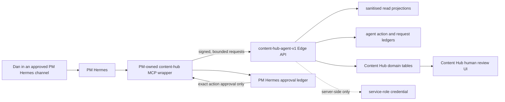

# Plan: PM Hermes Agent Integration

> Source review: [`PROJECT.md`](../PROJECT.md), [`README.md`](../README.md), [`docs/platform-docs.md`](../docs/platform-docs.md), the current Content Hub application and Supabase boundaries, and the PM Hermes control-plane and approval runbooks reviewed on 18 July 2026.

## Plan status

- **Approved shape:** three larger vertical phases, following the previously requested “fewer, larger” planning style
- **Primary objective:** let PM Hermes safely read, create and update Content Hub records and use the app for evidence-based reporting while preserving human approval and publication control
- **Required write outcome:** Phase 2 is not complete until Hermes can create a live idea or draft and update an existing eligible entry after exact approval
- **Required reporting outcome:** the project is not complete until Hermes can analyse live reporting data and create and update a saved report after exact approval
- **Production boundary:** the live GitHub Pages frontend and shared Intel Hub Supabase project only; the legacy standalone Supabase project is out of scope
- **Recommended integration:** a PM-owned local MCP wrapper calling a narrow, versioned Supabase Edge API
- **Security posture:** no browser automation, raw database tool, service-role key, provider token, approval power or publication power is exposed to Hermes
- **Migration constraint:** use the approved Supabase migration workflow during implementation; do not edit migration history directly

### Implementation checkpoint — 19 July 2026

- **Implemented locally:** the Phase 1 signed read contract and the Phase 2 service-only action ledger, validated proposal schemas, exact local approval receipts, conflict-safe/idempotent executor, content/report write operations, provenance UI, control-plane registrations, tests and rollout runbook.
- **Registered locally:** Hermes discovers 18 tools: nine bounded reads and nine governed proposal/status/execution tools. Proposal and execution switches are independently off by default, and no action type is enabled.
- **Not deployed:** none of the PM Hermes migrations or new/changed Edge Functions have been applied to production in this checkpoint; the anonymous policy remains live until the ordered review smoke test and lockdown step.
- **Pending:** Phase 1 production rollout, Phase 2 proposal-only and mutation canaries, and Phase 3 production hardening. Approval, publication, retry, deletion, administration and arbitrary database tools remain absent.

This is an implementation plan, not authorisation to change production. Each production mutation performed through PM Hermes will still require the exact human approval defined by the PM Hermes control plane.

## Outcome

When this plan is complete, Dan can ask PM Hermes to:

- explain what is planned, awaiting review, approved or published;
- summarise the content calendar and organic performance;
- retrieve a bounded, sanitised view of an individual entry;
- create new ideas and content drafts in the live app after explicit approval;
- update eligible content, metadata, dates, comments and review state after explicit approval;
- answer reporting questions with an explicit period, source and analytics coverage;
- compare reporting periods and explain notable changes without inventing missing data;
- create and update monthly, quarterly, annual or campaign reports in the live Reporting and Insights experience after explicit approval;
- report social publication job status and highlight work needing human attention.

PM Hermes will not be able to:

- approve or reject content;
- publish, schedule, retry or delete a social post;
- manage users, approvers, guidelines, platform connections or OAuth;
- read provider credentials, application secrets or unrestricted database rows;
- execute arbitrary SQL, use raw Supabase MCP tools or operate the app through a browser;
- turn content retrieved from the app into instructions for the agent.

## Current baseline

Content Hub already has useful boundaries to build on:

- authenticated browser access for normal owner workflows;
- server-authoritative, revision-bound approval and durable publication jobs;
- Edge Functions for privileged publication and platform-connection operations;
- public GitHub Pages delivery backed by the shared production Supabase project;
- an existing PM Hermes organic reporting route and `content-hub-social-snapshot.py` wrapper.

The previous reporting wrapper was not a safe foundation for broader access: it read the `entries` REST endpoint with the public anonymous key and depended on a broad anonymous row-selection policy used by review links. The local Phase 1 implementation now replaces both dependencies with purpose-built Edge projections. Production continues to use the previous boundary until the ordered rollout and review smoke test are completed.

The repository also contains two report models. The currently rendered Reporting and Insights screens save `monthly_reports`; the richer `reporting_periods` workspace is initialised but not rendered. The first integration must use the live `monthly_reports` path as its single write target and must not dual-write or silently merge the two models.

## User stories

- **US-1 — Understand:** As Dan, I can ask PM Hermes what is planned, due, published or performing well without opening Content Hub.
- **US-2 — Write and update:** As Dan, I can ask PM Hermes to create a new idea or draft and update an existing eligible entry using the Content Hub content model.
- **US-3 — Control:** As Dan, I see the exact proposed production change and approve it once before it is applied.
- **US-4 — Retain authority:** As an approver, I remain the only actor who can approve content, and publication remains a deliberate human action in Content Hub.
- **US-5 — Audit and recover:** As the application owner, I can see what Hermes attempted, what changed, and disable the integration without disrupting normal app use.
- **US-6 — Report:** As Dan, I can ask PM Hermes to analyse live performance, compare periods, and create or update an evidence-based saved report in Content Hub.

## Target architecture

### Boundary ownership

- **Content Hub owns** application data, validation, revision checks, action execution, idempotency and the authoritative audit trail.
- **The PM Hermes wrapper owns** tool schemas, local channel identity, approval-ledger checks, sanitised presentation and the decision to send an already-approved action for execution.
- **The human owner owns** content approval, publication, connection management and every exact production mutation approval.
- **Supabase Edge secrets own** the server-side integration secret and service-role access. No secret is returned to Hermes, written to a prompt or persisted in an action payload.

### Authentication and replay protection

Use a dedicated integration client rather than pretending Hermes is an application user.

- Give the wrapper a long random client secret held only by the approved Hermes secret backend/process environment and the Edge secret store.
- Sign each request over the client ID, timestamp, unique nonce, HTTP method, route and body hash.
- Allow a small clock-skew window and reject expired timestamps, duplicate nonces, malformed signatures and disabled clients.
- Store only request metadata and hashes in a service-only request ledger; never store the secret or full content body there.
- Bound request size, date ranges, pagination and response fields, with simple per-client throttling suitable for this single-owner tool.
- Return stable error codes and sanitised messages. Do not return database, provider or exception text.

### Data and provenance

Add two small service-only concepts through the normal migration flow:

- **Agent request record:** client, capability, nonce, payload hash, result class and timestamps. Its unique nonce provides replay protection.
- **Agent action record:** proposed action type, canonical payload hash, target entry/revision, expiry, approval reference, idempotency key, lifecycle and fixed result class.

Both tables must have RLS enabled and no browser mutation policy. Audit records must exclude secrets, provider responses and unnecessary content bodies. Existing entries remain human-owned records; Hermes provenance is an immutable action/activity projection, not a fake owner or approver account.

### Capability policy

| Capability                                          | Initial policy | Human approval      | Notes                                           |
| --------------------------------------------------- | -------------- | ------------------- | ----------------------------------------------- |
| Health and contract status                          | Allow          | No                  | Reveals no secrets or infrastructure detail     |
| List/search entry summaries                         | Allow          | No                  | Bounded filters, fields and pagination          |
| Read one entry projection                           | Allow          | No                  | Sanitised content and workflow metadata only    |
| Calendar and live reporting summaries               | Allow          | No                  | Replaces anonymous REST reporting access        |
| List, read and compare saved reports                | Allow          | No                  | Bounded periods and field projections           |
| Publication status                                  | Allow          | No                  | Status and safe error class only                |
| Read relevant content guidance                      | Allow          | No                  | Read-only projection, not arbitrary file access |
| Prepare a proposed content change                   | Allow          | No                  | Creates an inert proposal, not application data |
| Create a live idea or draft                         | Approval-gated | Yes, exact action   | One-time and idempotent                         |
| Update an eligible existing entry                   | Approval-gated | Yes, exact action   | Revision-checked and idempotent                 |
| Add a comment or submit for review                  | Approval-gated | Yes, exact action   | One-time, allowlisted transition                |
| Create or update a saved report                     | Approval-gated | Yes, exact action   | Evidence-bound and conflict-checked             |
| Approve/reject content                              | Block          | Not delegable       | Human Content Hub workflow only                 |
| Publish/schedule/retry/delete                       | Block          | Not in this project | Human Content Hub workflow only                 |
| Users, approvers, guidelines, connections or tokens | Block          | Not in this project | Administrative boundary                         |
| Arbitrary table/SQL/Supabase access                 | Block          | Not applicable      | No raw database tools                           |

### Required write scope

The first production write release must support all of the following:

- create a Content Hub idea;
- create a content entry in Draft state;
- update eligible Draft or In Review entries, including captions, platform selections, planned dates, links, campaign/pillar assignments and supported text asset metadata;
- add a comment to a visible, non-deleted entry;
- submit an eligible Draft for human review;
- return the authoritative saved record and Hermes provenance after each successful write.

Approved, Published and soft-deleted records are not directly editable by Hermes in the initial scope. A human must first return an Approved item to an editable workflow state. Initial write support may reference existing approved Storage objects but does not fetch arbitrary remote media or upload files.

### Required reporting scope

The reporting capability must support all of the following:

- query post-level organic metrics by explicit date range, platform, campaign, pillar and asset type;
- state how many eligible posts were found, how many contain analytics, which platforms are covered and where data is incomplete;
- retrieve saved reports and compare equivalent metrics across two reporting periods;
- identify top and underperforming content with links back to the supporting Content Hub entry IDs;
- prepare a monthly, quarterly, annual or campaign report containing platform metrics and the existing qualitative sections;
- create a new saved report or update an existing saved report after exact approval and return the authoritative saved result;
- keep report PDF/print export as an attended Content Hub action in the initial release.

For the initial integration, `monthly_reports` is the canonical saved-report write target because it backs the live Reporting and Insights screens. `reporting_periods` remains outside the agent tool contract until the product has one canonical reporting model.

## Durable decisions

1. **Use an API/tool integration, not UI automation.** The GitHub Pages app can change presentation without breaking the agent contract, and attended browser sessions are not a safe service boundary.
2. **Use a PM-owned MCP wrapper, not raw Supabase MCP.** It is the smallest Hermes-native surface that can enforce schemas, approvals, output filtering and audit conventions.
3. **Keep one versioned server contract.** `content-hub-agent-v1` exposes named, allowlisted operations through a single authenticated Edge boundary. Its health response reports contract version and enabled mode.
4. **Start read-only.** Production write tools are not registered until the replacement reporting flow and security tests have run successfully in production.
5. **Make proposals inert.** A proposal contains a canonical payload and hash but changes no Content Hub record.
6. **Require exact, one-time approval for writes.** The wrapper verifies a matching approved PM Hermes ledger item; the Edge API verifies action ID, payload hash, expiry, target revision and unused idempotency key.
7. **Fail on stale state.** Entry updates carry the expected content revision or update timestamp. A concurrent human edit invalidates the proposal and requires a new summary and approval.
8. **Never delegate approval or publication.** Hermes may submit a draft for review and report publication status, but it cannot set approval fields, invoke publishing or retry an ambiguous outcome.
9. **Treat content as untrusted data.** Captions, comments, links and imported text are quoted data in tool responses and cannot expand permissions or issue tool instructions.
10. **Keep disablement simple.** Removing the MCP server from the Hermes allowlist or revoking the integration secret immediately stops agent access without affecting the human app.
11. **Keep reporting evidence-bound.** Every answer and saved report states its date range, metric source and analytics coverage. Missing data is reported as missing, not converted to zero or filled by inference.
12. **Avoid report-store divergence.** Agent writes target `monthly_reports` only in the first release. Any later consolidation with `reporting_periods` is a separate migration decision with parity tests.

## Phase 1: Secure read-only foundation

**Objective:** give PM Hermes useful, production-safe visibility while removing the existing anonymous database-read dependency.

**User stories:** US-1, US-6 read access, and the read-only portion of US-5.

### What to build

- Add the authenticated `content-hub-agent-v1` Edge boundary with HMAC verification, nonce replay protection, input limits, safe error mapping and request auditing.
- Add read projections for health, entry summaries, one entry, calendar summary, organic reporting, saved-report listing/comparison and publication status.
- Return only fields needed for the requested operation. Exclude ownership internals, email addresses, provider IDs, secrets, connection metadata and raw stored error text.
- Add a signed review-link read projection so public review pages no longer select `entries` directly.
- Remove the broad anonymous `entries` selection policy only after both review links and reporting use the new projections.
- Build the PM-owned local MCP wrapper with read-only schemas and explicit output labelling that treats returned content as untrusted data.
- Replace `content-hub-social-snapshot.py` direct REST queries with the new reporting operation while preserving its current bounded snapshot output.
- Expose the live saved-report model and metric registry through bounded projections so Hermes can explain definitions, period comparisons and report coverage without arbitrary table access.
- Document `monthly_reports` as the initial canonical agent write target and keep the unused `reporting_periods` model outside the agent contract while product reconciliation remains outstanding.
- Register only the read tools in PM Hermes capability, tool-availability and security registries.
- Add a small owner-visible integration status showing contract health, last successful request and recent safe result classes.
- Document enable, disable, secret rotation, smoke-test and rollback procedures.

### Acceptance criteria

- PM Hermes can answer “What is planned next week?” and “How did organic posts perform in the last 30 days?” from live Content Hub data.
- PM Hermes can answer “Compare this quarter with the previous quarter” using equivalent saved/live metrics and explicit coverage for both periods.
- The same reporting totals remain explainable by coverage, platform and date window after the wrapper migration.
- Missing platform analytics remain visibly missing and are never presented as measured zero performance.
- An anonymous caller cannot read `entries` through PostgREST after the review projection is deployed.
- A valid review token returns only the intended review projection; an invalid, expired or reused token fails closed as appropriate to its contract.
- Invalid signatures, expired timestamps, replayed nonces, disabled clients, excessive request sizes and out-of-range queries are rejected before domain reads.
- Responses and logs contain no service-role key, integration secret, provider token, platform connection record, personal email or provider response body.
- Text resembling instructions inside captions or comments is returned as data and cannot select another tool or widen a query.
- Only read operations are present in the live PM Hermes tool catalogue.
- Revoking the client secret or disabling the server registration stops Hermes access while Content Hub remains usable by the owner.

### Validation

- Edge unit tests for signature canonicalisation, clock skew, nonce replay, rate/size limits and safe errors.
- Database policy tests proving anonymous table reads fail and service-only request records remain inaccessible to browser roles.
- Contract tests for every projection, field allowlist, pagination, timezone, saved-report comparison and reporting coverage calculation.
- Prompt-injection fixtures in entry captions, comments and links.
- Review-link success, expiry, tampering and over-broad field regression tests.
- MCP schema tests, PM Hermes control-plane validation, tool readiness, manual smoke tests and the standard Hermes doctor/security checks.
- Application typecheck, lint, focused tests and production build.

### Rollout and rollback

1. Deploy the Edge boundary and request ledger with the integration client disabled by default.
2. Enable and smoke-test one read client against production.
3. Move the existing social snapshot wrapper and signed review reads to the Edge projections.
4. Verify review links and reporting, then remove anonymous table selection.
5. Register the remaining read tools for PM Hermes.

Rollback disables the MCP registration and integration client first. Restore the previous review/reporting route only if necessary; do not restore broad anonymous access as a routine rollback. Retain safe audit metadata for incident analysis.

### Suggested commit boundaries

1. Edge authentication, request ledger and read projections.
2. Signed review projection and anonymous RLS lockdown.
3. MCP wrapper, reporting migration and Hermes registry updates.
4. Integration status, tests and runbook.

## Phase 2: Approval-gated writing and updating

**Objective:** let PM Hermes create and update real content and saved reporting records through exact, reversible, human-approved actions without granting approval, publication or administrative authority.

**User stories:** US-2, US-3, US-4, US-5 and US-6 write access.

### What to build

- Add inert proposals and the service-only agent action lifecycle: Proposed, Executing, Applied, Rejected, Expired or Failed.
- Implement the complete required write scope: create ideas and drafts, update eligible existing entries, add comments, and submit Drafts for human review.
- Implement the required reporting write scope: create and update monthly, quarterly, annual and campaign reports in `monthly_reports` without dual-writing to `reporting_periods`.
- Build report proposals from authoritative Content Hub analytics and saved-report data. Calculated values are server-derived; manually supplied figures require an exact value, named source and explicit approval.
- Allow Hermes to draft qualitative findings, risks, themes, highlights and next-period focus, while retaining entry/report references that support each material claim.
- Validate proposed payloads through the same domain rules used by Content Hub, including content format, platform capability, required media metadata, dates and PM language guidance.
- Return an exact human-readable change summary, action ID, short payload hash, target revision and expiry before approval is requested.
- Connect proposals to the PM Hermes approval ledger. The explicit confirmation is `execute <action-id>` after the exact summary is shown.
- Make the execution wrapper reject missing, mismatched, expired, cancelled or previously consumed approval records before any outbound mutation call.
- Make the Edge executor re-check action ID, canonical payload hash, action expiry, expected entry revision and idempotency key in one transaction before applying the change.
- Record immutable Hermes provenance and show it in the entry activity/history surface, including who approved execution and the safe outcome class.
- Label Hermes-created drafts clearly and route submitted work through the ordinary Content Hub human review process.
- Return and re-read the authoritative saved record after execution so Hermes reports what Content Hub actually stored rather than echoing the proposal.
- Keep approval fields, publication RPCs, scheduling, deletion and administrative tables unreachable from the agent operation dispatcher.

### Acceptance criteria

- Asking Hermes to draft content creates only a proposal until Dan approves the exact action.
- After exact approval, Hermes can create a live idea or draft and retrieve its authoritative Content Hub identifier and saved values.
- After a separate exact approval, Hermes can update an eligible existing entry and retrieve the new authoritative revision and saved values.
- After exact approval, Hermes can create a saved report which appears in the live Reporting and Insights screens with the correct report type and period.
- After a separate exact approval, Hermes can update that saved report using its expected `updated_at`; a concurrent human edit fails with a conflict and requires a fresh proposal.
- Report proposals state the period, analytics coverage, calculated versus manual metrics, evidence references and every qualitative field that will be saved.
- Server-derived metrics match the existing per-post aggregation and live Reporting/Insights metric definitions for the same entries and date range.
- Missing data remains explicit, and generated narrative distinguishes observed evidence from interpretation.
- The approval summary identifies action type, target, changed fields, planned dates/platforms, payload hash and expiry without exposing implementation or secret data.
- `execute <action-id>` applies the matching proposal once; retries return the original result and cannot duplicate an entry, comment or state transition.
- A hash mismatch, expired action, reused approval, disabled client or concurrent human edit makes no application change and asks for a fresh proposal.
- Hermes can move eligible work only as far as Ready for Review. It cannot populate approval revision/time, approve, publish, schedule, retry or delete.
- Approved, Published and soft-deleted entries reject direct Hermes updates, including crafted requests that bypass the wrapper.
- Hermes cannot delete reports, overwrite a different period through upsert ambiguity, write to both report stores, alter analytics imports, or mark a report Published.
- A Hermes-created or changed entry shows agent provenance and the approving human action reference in Content Hub.
- Human edits, review, approval and publication continue to work when the Hermes integration is disabled.
- Fixed error classes distinguish validation, conflict, expired approval, unavailable dependency and unknown outcome without leaking database/provider detail.

### Validation

- Unit and contract tests for proposal canonicalisation, payload hashing, expiry, action summaries and allowed field schemas.
- Database concurrency tests for one-time action consumption, idempotent replay and simultaneous human/agent edits.
- Negative authorisation tests proving every blocked field and operation remains unreachable through crafted payloads.
- Approval-ledger tests for missing, rejected, expired, reused and mismatched actions.
- Reporting tests for date boundaries, platform keys, coverage, period uniqueness, manual-metric source evidence and authoritative report read-after-write.
- End-to-end create canary: propose a draft, approve its exact action, create it once and re-read the stored record.
- End-to-end update canary: propose a change to that draft, approve the new exact action, update it once, verify the new revision, submit it for review through another exact action, then complete approval manually in Content Hub.
- End-to-end reporting canary: generate a monthly report proposal from a bounded period, verify its calculations and coverage, approve its creation, confirm it appears in Reporting and Insights, then approve one conflict-checked narrative update.
- UI tests for provenance, conflict messaging and disabled-integration behaviour.
- Application, Edge, MCP, PM Hermes registry and doctor/security verification from Phase 1.

### Rollout and rollback

1. Deploy proposal storage and execution code with all write operations disabled.
2. Enable proposal-only tools for the owner and test summaries without application mutations.
3. Enable one write kind—new draft—for a manual production canary with an exact approval.
4. Review its database record, provenance and audit trail, then enable one update operation for a second exact-approval canary.
5. Enable comment and submit-for-review operations only after both content create and update canaries pass.
6. Enable saved-report creation, then saved-report updates, only after the reporting canary matches the live UI. Keep all recurring write jobs disabled.

Rollback removes write tools from the Hermes allowlist and disables write mode on the Edge contract. Existing drafts remain ordinary Content Hub records; proposed or failed action records can expire in place. Read-only tools may remain enabled if their health checks pass.

### Suggested commit boundaries

1. Agent action model, proposal validation and safe summaries.
2. Exact approval bridge, transactional executor and idempotency.
3. Draft/update/comment/review operations and negative authorisation tests.
4. Provenance UI, canary controls and operational documentation.

## Phase 3: Production hardening and governed operation

**Objective:** make the integration observable, recoverable and supportable before it becomes a normal PM workflow.

**User stories:** all, with emphasis on US-5.

### What to build

- Add dashboards or concise owner views for client health, request/action outcomes, approval expiry, conflicts and repeated authentication failures.
- Add reporting-contract health for analytics coverage, stale saved reports, report-store drift and failed report calculations.
- Add bounded alerts through the existing Hermes job/alert infrastructure for integration unavailability, repeated auth failures, stuck Executing actions and contract-version drift.
- Define retention and redaction for request metadata, action summaries and local run artefacts; keep secrets and raw provider responses out of every layer.
- Add contract-version negotiation so an incompatible wrapper or Edge deployment fails closed with an actionable health result.
- Add dependency and supply-chain checks for the small MCP server and pin its runtime dependencies.
- Complete the PM Hermes capability route, tool availability, security, approval and social registry documentation, plus a single operational runbook.
- Exercise secret rotation, client disablement, database failure, Edge rollback, lost-response recovery and Content Hub-offline scenarios.
- Permit optional recurring **read-only** summaries only after the manual read workflow is stable. Scheduled mutations remain prohibited.
- Capture usage and rejected-action evidence for a later, separate decision on whether additional write types such as analytics imports or campaign administration are justified.

### Acceptance criteria

- The owner can identify the last successful request, last applied action and reason for any failed or blocked action without inspecting raw logs.
- A wrapper/Edge contract mismatch disables affected tools rather than attempting a best-effort mutation.
- Secret rotation and emergency disablement are tested and documented with a recovery target suitable for an internal production tool.
- Stuck, duplicate and ambiguous action executions produce alerts and remain safe to inspect; none trigger blind retry.
- PM Hermes control-plane validation, readiness, smoke tests, doctor and security checks all pass from the canonical PM workspace.
- A recurring read-only summary, if enabled, uses the same bounded contract and creates no Content Hub or external-platform side effect.
- Reporting alerts distinguish genuinely poor performance from missing or stale analytics and never notify on a fabricated zero.
- The runbook names owners, prerequisites, production checks, evidence locations, rollback steps and the explicit list of permanently blocked operations.
- No outstanding Critical or High security finding remains in the integration boundary.

### Validation

- Full application tests, typecheck, lint and production build.
- Full Edge test/check suite and database RLS/concurrency invariants.
- MCP contract, authentication, redaction and adverse-input suites.
- Failure-injection tests for unavailable database, timeout, lost response, duplicate execution and audit-write failure.
- Hermes registry/control-plane tests, readiness, smoke, doctor and security checks.
- Manual production canary evidence for one read workflow, one approved content create/update workflow and one approved report create/update workflow.
- Final security-focused differential review before general enablement.

### Rollout and rollback

- Roll out to Dan’s PM Hermes identity only; do not infer access for Personal Hermes or other agents.
- Keep read and write modes independently switchable.
- Enable read-only recurring summaries only after at least one week of clean manual use and review of audit volume.
- Revoke the integration secret and disable the MCP registration for emergency shutdown; this must not require a frontend deployment.
- Roll back Edge and wrapper versions as a matched contract pair. Never compensate for drift by widening permissions.

### Suggested commit boundaries

1. Health, observability, alerts and retention/redaction.
2. Contract-version enforcement and failure-injection coverage.
3. Hermes control-plane/runbook completion and production canary evidence.
4. Final review fixes and optional read-only schedule enablement.

## Cross-phase quality gates

- Application TypeScript remains strict, and every wrapper/tool schema is explicitly typed and runtime-validated.
- User-facing copy and tool summaries use British English and PM’s rights-based terminology.
- Every operation has an explicit request/response schema, upper bounds and stable error classes.
- RLS tests cover anonymous, authenticated owner, other authenticated user and service contexts.
- No browser bundle, prompt, tool response, log, DEVLOG entry or run artefact contains a secret.
- The integration never contacts social providers directly and never obtains their credentials.
- Content Hub remains fully usable if every Hermes component is offline.
- Tests assert observable behaviour: allowed reads, exact proposed changes, one-time writes, provenance and blocked authority.
- Reporting outputs and proposals always identify date range, source, coverage and evidence/inference boundaries.
- Production rollout uses the shared runtime project, follows the established preflight gates and records rollback evidence.

## Key risks and mitigations

| Risk                                         | Mitigation                                                                                                               |
| -------------------------------------------- | ------------------------------------------------------------------------------------------------------------------------ |
| Prompt injection stored in content           | Treat all fields as data, return typed projections, prohibit content-controlled tool selection and test hostile fixtures |
| Secret or privileged database exposure       | HMAC client boundary, server-side service role, field allowlists, safe errors and redaction tests                        |
| Broad anonymous access survives              | Move review/reporting reads first, then remove anonymous table selection with policy tests                               |
| Agent changes the wrong revision             | Bind proposals to canonical payload hash and expected revision; fail on conflict                                         |
| Duplicate production writes                  | One-time approval, transactional action consumption and idempotent result replay                                         |
| Hermes gains editorial authority by accident | Explicit dispatcher allowlist and negative tests for approval, publication, deletion and administration                  |
| Wrapper and Edge drift                       | Versioned contract health check and fail-closed registration/readiness                                                   |
| Two report stores diverge                    | Write only to the live `monthly_reports` model; prohibit dual writes and test UI parity                                  |
| Incomplete analytics misread as poor results | Return coverage alongside metrics and keep missing values distinct from measured zero                                    |
| Generated narrative overstates evidence      | Bind material claims to report/entry references and label interpretation separately                                      |
| Operational complexity outweighs value       | One Edge boundary, one small wrapper, two service-only records and three staged phases                                   |

## Indicative sequence and effort

| Phase                                          | Indicative effort     | Exit condition                                                          |
| ---------------------------------------------- | --------------------- | ----------------------------------------------------------------------- |
| 1. Secure read-only foundation                 | 6–9 engineering days  | Live content/report reads work; direct anonymous entry reads are closed |
| 2. Approval-gated writing and updating         | 8–12 engineering days | Content and report create/update canaries succeed with provenance       |
| 3. Production hardening and governed operation | 4–7 engineering days  | Reviews and operational checks pass; rollout and rollback are evidenced |

These are implementation ranges, not calendar commitments. Phase 2 does not start until Phase 1’s production security boundary is verified.

## Completion definition

The project is complete when PM Hermes can reliably read live Content Hub state, answer evidence-based reporting questions, create a live idea or draft, update an eligible existing entry, and create and update a saved report through exact human-approved actions. All writes must have conflict safety and visible provenance, while content approval, social publication, report publication, secrets, administrative controls and arbitrary database access remain technically unreachable.

Any future request for Hermes-triggered scheduling or publication must be treated as a separate security-reviewed project with a new explicit approval model. It is not a latent extension of this plan.
